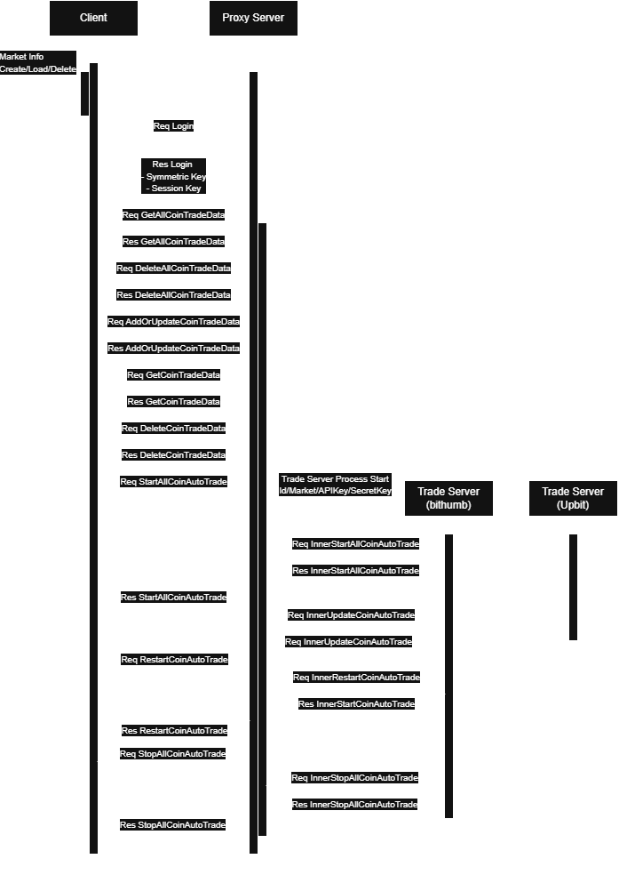
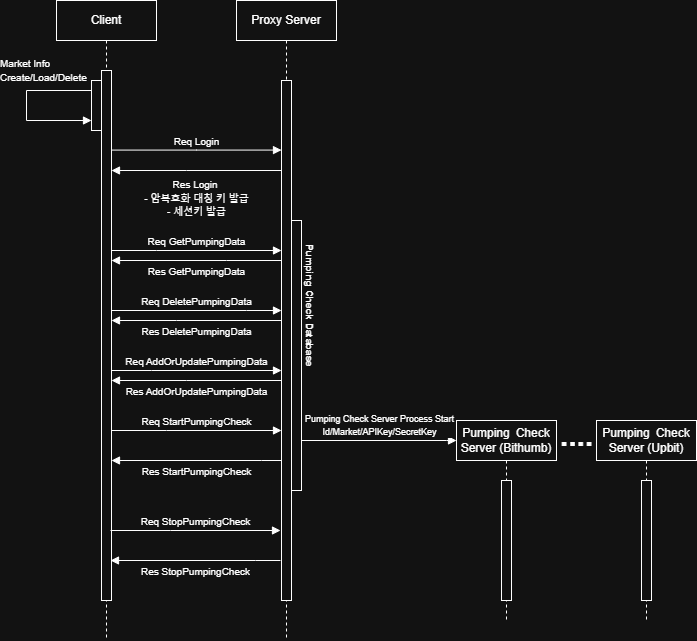

# Project
> 거래소에서 코인을 거래할 때 사용할 있는 트레이드 봇

---

## 목차
1. [구조](#구조)
2. [설치](#설치)
3. [사용 방법](#사용-방법)

## 프로젝트 구조
### 자동 매매 프로세스

---

### 펌핑 체크 프로세스

---

## 설치
### 필수 조건
- .net 8.0 

---
## 사용 방법
- 자세한 사용 방법 및 구조는 다음의 블로그를 참고해주세요.
- https://everyday-devup.tistory.com/