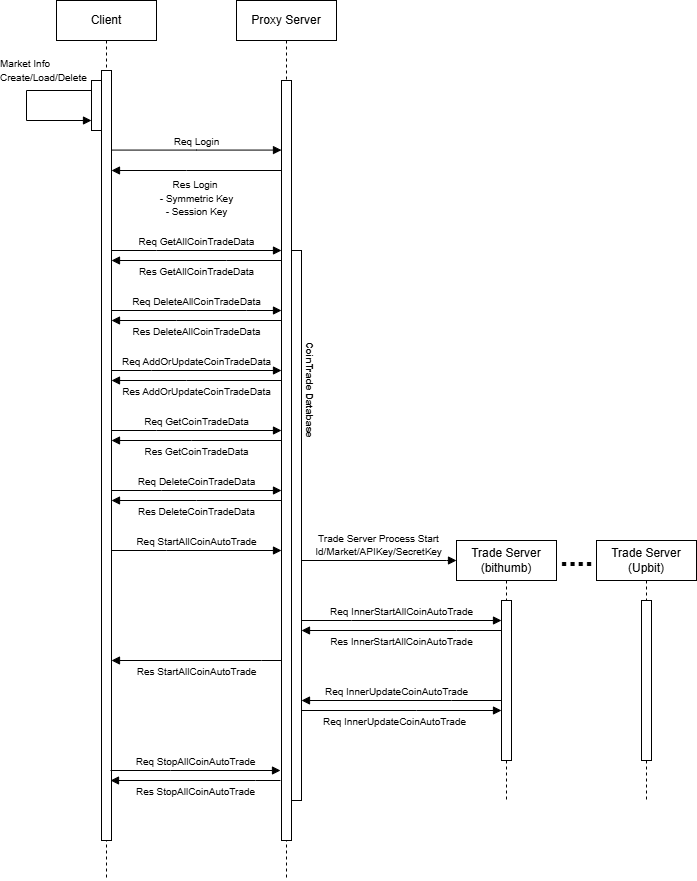

## 마일스톤
> ### Proto
> 거래소 Open API를 C#으로 구현 및 코인 매매 관련 로직을 검증하기 위한 버전

> ### Alpha
> 자동 트레이드에 사용할 거래소를 프로세스로 분리하여, 프로세스의 추가/삭제가 용이할 수 있도록 함
> 
> Proto 버전 사용 시 부족한 편의 기능 구현
> > 특정 코인의 거래를 멈추거나 설정된 데이터의 정보를 변경할 수 없는 이슈
> > 
> > 특정 코인의 현재 트레이드 정보를 알 수 없음
> >
> > 알림 기능의 부재로 중요한 이벤트를 알 수 없음 (코인 매매 시점 / 코인 매도 시점)
> 
> > ### Update v.0.1.0
> > 1. 내부 패킷 및 외부 패킷의 암호화 구현
> > 2. 텔레그렘 봇을 사용한 노티 기능 추가
> > 3. 업비트 거래소 Open Api 기능 추가
> > 4. 코인 매매 정보 조회/추가/삭제 기능 추가
> > 5. 코인 트레이드 전략 수정
---

### Alpha v.0.1.0 기준 작성 사항

## 목차
1. [솔루션 구조](#솔루션-구조)
2. [플로우](#플로우)
3. [설치 및 사용 방법](#설치-및-사용-방법)

## 솔루션 구조

---

## 플로우

---

## 설치 및 사용 방법
### 필수 조건
- .net 8.0 

---
## 사용 방법
- 자세한 사용 방법 및 구조는 다음의 블로그를 참고해주세요.
- https://everyday-devup.tistory.com/